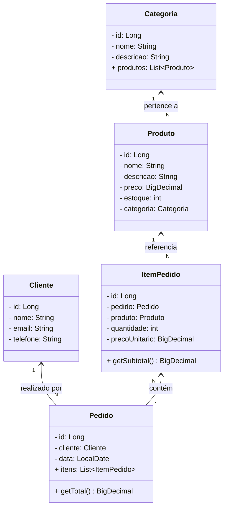

# 🛍️ Sistema de Controle de Estoque e Vendas (API RESTful)


API desenvolvida em Java com Spring Boot para gerenciamento de produtos, categorias, clientes e pedidos. Projeto realizado como parte do curso de Desenvolvimento de APIs com Spring Framework da Digital Innovation One (DIO).

## 📋 Tabela de Conteúdos
- [Funcionalidades](#-funcionalidades)
- [Tecnologias Utilizadas](#%EF%B8%8F-tecnologias-utilizadas)
- [Diagrama de Classes](#-diagrama-de-classes)
- [Instalação e Uso](#%EF%B8%8F-instalação-e-uso)

## 🚀 Funcionalidades
- **Gestão de Produtos**: CRUD completo com controle de estoque
- **Organização por Categorias**: Classificação de produtos
- **Sistema de Pedidos**: Registro com cálculo automático de valores
- **Cadastro de Clientes**: Dados completos com validação

## 🛠️ Tecnologias Utilizadas
### **Backend**
- Java 21
- Spring Boot 3.2+
- Spring Data JPA
- Hibernate
- Lombok

### **Banco de Dados**
- H2 (Desenvolvimento)
- PostgreSQL (Produção)

### **Ferramentas e Deploy**
- Gradle
- Swagger UI
- Docker
- Railway

## 📊 Diagrama de Classes

```mermaid
classDiagram
    direction BT

    class Produto {
        - id: Long
        - nome: String
        - descricao: String
        - preco: BigDecimal
        - estoque: int
        - categoria: Categoria
    }

    class Categoria {
        - id: Long
        - nome: String
        - descricao: String
        + produtos: List~Produto~
    }

    class Cliente {
        - id: Long
        - nome: String
        - email: String
        - telefone: String
    }

    class Pedido {
        - id: Long
        - cliente: Cliente
        - data: LocalDate
        + getTotal() BigDecimal
        + itens: List~ItemPedido~
    }

    class ItemPedido {
        - id: Long
        - pedido: Pedido
        - produto: Produto
        - quantidade: int
        - precoUnitario: BigDecimal
        + getSubtotal() BigDecimal
    }

    Produto "N" --> "1" Categoria : pertence a
    Pedido "1" --> "N" ItemPedido : contém
    ItemPedido "N" --> "1" Produto : referencia
    Pedido "N" --> "1" Cliente : realizado por
```

## ⚙️ Instalação e Uso
### API na Nuvem
É possível acessar a API diretamente na nuvem clicando [aqui](https://spring-inventory-system-api.up.railway.app/swagger-ui/index.html#/).
Caso não esteja disponível, segue instruções para rodar o projeto localmente.

---

### **Pré-requisitos**
- [Java JDK 21](https://jdk.java.net/21/)
- [Gradle 8.5+](https://gradle.org/install/)

### **Passo a Passo Rápido**
1. Clone o repositório:
```bash
git clone https://github.com/Matheus-Marti1/spring-inventory-system-api.git
cd spring-inventory-system-api
```

2. Inicie a API com banco H2:
```bash
./gradlew bootRun --args='--spring.profiles.active=dev'
```

3. Acesse os recursos:
- **Swagger UI**: http://localhost:8080/swagger-ui.html
- **H2 Console**: http://localhost:8080/h2-console  
  _(Credenciais: JDBC URL = `jdbc:h2:mem:apirest`, User = `admin`, Password = vazio)_
